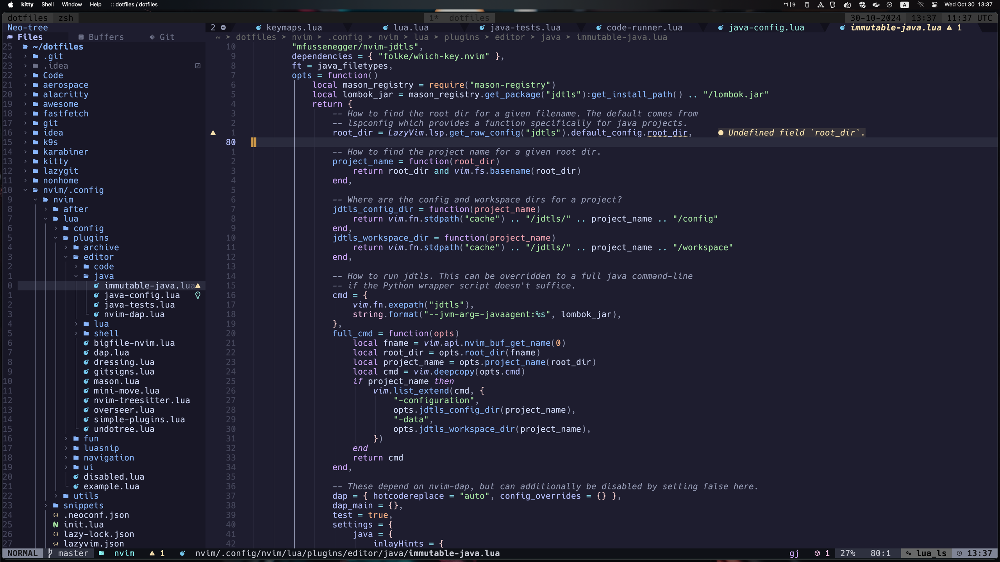
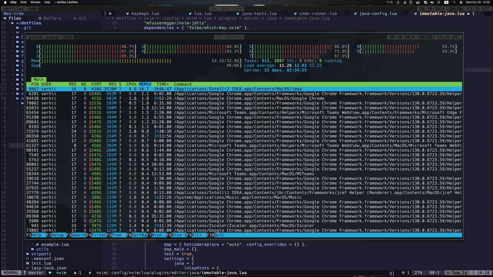
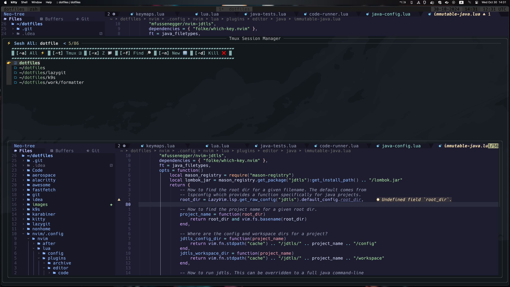
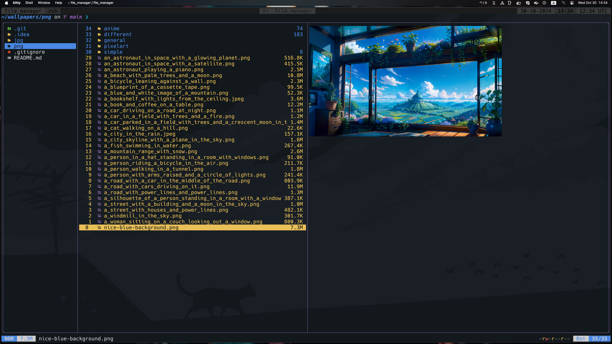
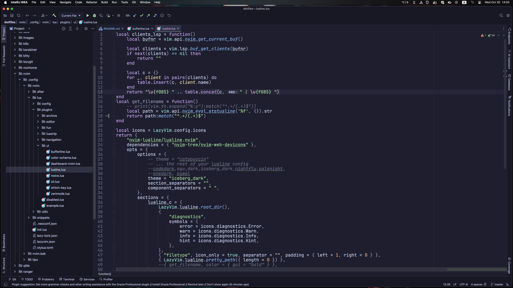

## My dotfiles

All dotfile catalogs structured to be used as symlinks by [gnu stow](https://www.gnu.org/software/stow/)

All scripts that using by dot configurations required to have `dotfiles` to be cloned directly in `$HOME` directory as `~/dotfiles`

Some of my configurations (terminals etc) are using wallpapers that can be found here [my wallpaper collection](https://gitlab.com/Serhii.Dudar1/wallpapers).
It's also required to have wallpaper in home directory `~/wallpapers`

My current tool preferences:
 - Terminal: [kitty](kitty)|[wezterm](wezterm) + [tmux](tmux) + [nvim](nvim)
 - SHELL: [zsh](zsh) + [ohmyz](https://ohmyz.sh/) + [starship](https://starship.rs/) + [fastfetch](https://github.com/fastfetch-cli/fastfetch) and so on
 - Editor: [nvim](nvim)
 - Tmux extensions: [tmux-powerline](tmux/.tmux/plugins/tmux-powerline) (customized), [sesh](https://github.com/joshmedeski/sesh) (as sessions manager + own customizations based on it and tmux api)   
 - Nerd-Fonts: [hack](https://www.programmingfonts.org/#hack), [CascadiaCode](https://www.programmingfonts.org/#cascadia-code), [FiraCode](https://www.programmingfonts.org/#firacode), [JetBrainsMono](https://www.programmingfonts.org/#jetbrainsmono)
 - File Manager: [yazi](yazi) (used [ranger](ranger) in past)
 - OS: linux (arch, ubuntu), macos
 - Tiling WM: macos - [aerospace](https://github.com/nikitabobko/AeroSpace), linux - [awesome](https://awesomewm.org/) / [qtile](https://qtile.org/), planning to try [hyprland](https://github.com/hyprwm/Hyprland)
 - Display server: [X11](https://www.x.org/wiki/) (Don't see that [Wayland](https://wayland.freedesktop.org/) is well-supported by tools I prefer for now)
 - Neovim: [LazyVim](https://www.lazyvim.org/) based [configuration](nvim/.config/nvim) with focus on effective working with many programming languages I'm working (java, gradle, maven, yaml, bash, lua, python, js/ts etc). My nvim configuration still evolving and I have many commented parts, but finished on ~85-90%, and I'm quite effectively using it in my daily workflow as `s/l java engineear`. Yes I still have to use intellij to do many specific tasks that have better support in intellij or no alternative in neovim (working with RDBMD (yes vim-dadbod is cool but not for professional using by my point of view for now), generation, previewing openapi etc), but in 80% cases I'm using neovim for all, especially for codding.
 - Keyboard programming mapping: macos - [karabiner](karabiner), linux - [keyd](nonhome/keyd)
 - Theme: [catppuccin-mocha](https://github.com/catppuccin/nvim)
 - Intellij: [.ideavimrc](idea/.ideavimrc), my [customized catppuccin-mocha](idea/Catppuccin_Mocha.icls) of [catppuccin theme](https://github.com/catppuccin/jetbrains) that I'm very used to in neovim

### Random screenshots (MACOS, AEROSPACE, KITTY, TMUX):

#### NEOVIM

### TMUX POPUP

### TMUX SESSION MANAGER

### YAZI

### Intellij

#### In many places of my dotfiles I have been inspired to learn so many new cool things (even new programming languages), mostly because of next cool guys:
- [typecraft_dev](https://www.youtube.com/@typecraft_dev)
- [teej_dv](https://www.youtube.com/@teej_dv)
- [ThePrimeagen](https://www.youtube.com/@ThePrimeagen)
- [joseanmartinez](https://www.youtube.com/@joseanmartinez)
- [devopstoolbox](https://www.youtube.com/@devopstoolbox)
- [ascourter](https://www.youtube.com/@ascourter)
- [folke](https://github.com/folke)
- [s1n7ax](https://github.com/s1n7ax)
- [lukesmith](https://lukesmith.xyz/)
- [DistroTube](https://www.youtube.com/@DistroTube)

