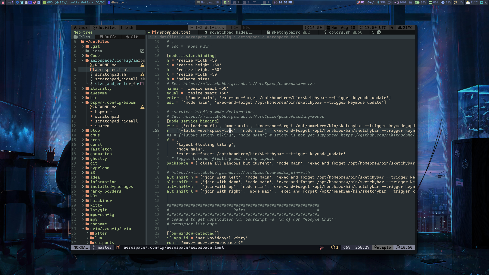

# My dotfiles

Just my personal dotfiles I'm using as for all my home Arch Linux machines (with various tiling window manager configs) as for my working machines as Software Engineer (mostly MacOS or Linux Debian based systems (mostly Ubuntu) )

---

My Arch Linux config random screen:

My MacOS config random screen:

---

Most of my dotfile catalogs structured to be used as symlinks by [gnu stow](https://www.gnu.org/software/stow/), where
config location is - `[app name]/[path to config from home dir that should be symlinked from repo catalog]`, for example
`nvim/.config/nvim`,
where `stow nvim` will create symlink under `~/.config/nvim` with link to
`~/dotfiles/nvim/.config/nvim`.

All scripts that using by dot configurations required to have `dotfiles` to be cloned directly in `$HOME` directory as
`~/dotfiles`

Some of my configurations (terminals etc) are using wallpapers that can be found
here [my wallpaper collection](https://gitlab.com/Serhii.Dudar1/wallpapers).
It's also required to have wallpaper in home directory `~/wallpapers`

## My current tool preferences

- Terminal: [ghostty](ghostty/.config/ghostty), [kitty](kitty/.config/kitty), [wezterm](wezterm/.config/wezterm)
- Multiplexer: [tmux](tmux) + [tmux-powerline](tmux-powerline/.config/tmux-powerline), [sesh](https://github.com/joshmedeski/sesh) (
  as sessions manager + own customizations based on it and tmux api)
- SHELL: [zsh](zsh) + [ohmyz](https://ohmyz.sh/) + [starship](starship/.config/starship.toml) + [fastfetch](fastfetch/.config/fastfetch)
  and so on
- Code: [nvim](nvim/.config/nvim), [intellij](idea/.ideavimrc) (only for working tasks, driven
  by [.ideavimrc](idea/.ideavimrc))
- Nerd-Fonts: [CascadiaCode](https://www.programmingfonts.org/#cascadia-code), [hack](https://www.programmingfonts.org/#hack), [FiraCode](https://www.programmingfonts.org/#firacode), [JetBrainsMono](https://www.programmingfonts.org/#jetbrainsmono)
- File Manager: [yazi](yazi/.config/yazi), (used ofter [ranger](ranger/.config/ranger) in past)
- OS: linux (arch, ubuntu), macos
- Tiling WM: linux (
  Wayland) - [hyprland](hyprland) + [waybar-hyprland](waybar/.config/waybar/hyprland-config.jsonc), [sway](sway/.config/sway) + [waybar-sway](waybar/.config/waybar/sway-config.jsonc)
- Tiling WM: linux (
  X11) - [xmonad](xmonad/.config/xmonad) + [xmobar](xmobar/.config/xmobar), [awesome](awesome/.config/awesome), [qtile](qtile/.config/qtile), [bspwm](bspwm/.config/bspwm) + [polybar](polybar/.config/polybar), [i3](i3/.config/i3) + [polybar](polybar/.config/polybar), [DWM](https://github.com/sergii-dudar/my-dwm) + [dwmblocks-async](suckless/dwmblocks-async)
- X11 compositor: [picom](picom/.config/picom)
- Tiling WM:
  macos - [aerospace](aerospace/.config/aerospace) + [sketchybar](sketchybar/.config/sketchybar) + [janky-borders](janky-borders/.config/borders)
- Neovim: [LazyVim](https://www.lazyvim.org/) based [configuration](nvim/.config/nvim), theme - `everforest`, bd -
  `hard` (the most eyes comfortable theme I ever used!), also I'm big fan of `catppuccin-mocha` theme, but my eyes not
  very like it to work 24/7 (too much blue) 😺
- Keyboard OS level tools: macos - [karabiner](karabiner/.config/karabiner),
  linux - [keyd](nonhome/keyd) / [kmonad](nonhome/kmonad)
- HotKeys launchers daemon: macos - using [aerospace](aerospace/.config/aerospace) support,
  X11 - [sxhkd](sxhkd/.config/sxhkd)
- Launchers (Wayland, X11): [rofi](rofi/.config/rofi) by
  using [fork with wayland support](https://github.com/in0ni/rofi-wayland)
- Notifications: X11 - [dunst](dunst/.config/dunst), Wayland - [swaync](swaync/.config/swaync), macos -
  builtin & [terminal-notifier](https://github.com/julienXX/terminal-notifier)
- Screen color temperature: X11 - [redshift](redshift/.config/redshift), sway -[gammastep](gammastep/.config/gammastep),
  hyprland - [hyprsunset](hyprland/hypr/scripts/hyprsunset.runner)
- Cron tasks: [cronie](cron)
- Music &
  Players: [rmpc](mpd-config/rmpc), [mpd-linux](mpd-config/mpd), [mpd-macos](mpd-config/mpd-osx), [mpv](mpv/.config/mpv), [ncmpcpp](mpd-config/ncmpcpp), [cmus](cmus/.config/cmus)
- Other
  tools: [btop](btop/.config/btop), [fastfetch](fastfetch/.config/fastfetch), [k9s](k9s/.config/k9s), [lazygit](lazygit/.config/lazygit), [zellij](zellij/.config/zellij)

## Configs readme with config screenshots

### Tiling Window Managers

- [Hyprland](hyprland/README.md)
- [Aerospace](aerospace/.config/aerospace/README.md)
- [Xmonad](xmonad/.config/xmonad/README.md)
- [DWM](suckless/DWM_README.md)
- [Sway](sway/.config/sway/README.md)
- [Awesome](awesome/.config/awesome/README.md)
- [Bspwm](bspwm/.config/bspwm/README.md)
- [Qtile](qtile/.config/qtile/README.md)
- [i3wm](i3/.config/i3/README.md)

### Other

- [Nvim](nvim/.config/nvim/README.md)
- [Tmux](tmux/README.md)
- [Fastfetch](fastfetch/.config/fastfetch/README.md)
- [MPD Ncmpcpp](mpd-config/ncmpcpp/README.md)
- [MPD Rmpc](mpd-config/rmpc/README.md)
- [Rofi](rofi/.config/rofi/README.md)
- [Yazi](yazi/.config/yazi/README.md)
- [Ranger](ranger/.config/ranger/README.md)