## My dotfiles

All dotfile catalogs structured to be used as symlinks by [gnu stow](https://www.gnu.org/software/stow/), where config location is - `[app name]/[path to config from home dir that should be symlinked from repo catalog]`, for example `nvim/.config/nvim`, where `stow nvim` will create symlink under `~/.config/nvim` with link to `~/dotfiles/nvim/.config/nvim`. Tools that not managed by stow, located in [nonhome](nonhome)

All scripts that using by dot configurations required to have `dotfiles` to be cloned directly in `$HOME` directory as `~/dotfiles`

Some of my configurations (terminals etc) are using wallpapers that can be found here [my wallpaper collection](https://gitlab.com/Serhii.Dudar1/wallpapers).
It's also required to have wallpaper in home directory `~/wallpapers`

My current tool preferences:

- Terminal: [kitty](kitty), [wezterm](wezterm)
- Multiplexer: [tmux](tmux) + [tmux-powerline](tmux/.tmux/plugins/tmux-powerline) (customized), [sesh](https://github.com/joshmedeski/sesh) (as sessions manager + own customizations based on it and tmux api)
- SHELL: [zsh](zsh) + [ohmyz](https://ohmyz.sh/) + [starship](https://starship.rs/) + [fastfetch](https://github.com/fastfetch-cli/fastfetch) and so on
- Editor: [nvim](nvim), [intellij](idea) (for specific work tasks)
- Nerd-Fonts: [hack](https://www.programmingfonts.org/#hack), [CascadiaCode](https://www.programmingfonts.org/#cascadia-code), [FiraCode](https://www.programmingfonts.org/#firacode), [JetBrainsMono](https://www.programmingfonts.org/#jetbrainsmono)
- File Manager: [yazi](yazi) (used [ranger](ranger) in past)
- OS: linux (arch, ubuntu), macos
- Tiling WM: macos - [aerospace](https://github.com/nikitabobko/AeroSpace), linux - [qtile](https://qtile.org/) (my daily driver) / [i3wm](https://i3wm.org/) / [hyprland](https://github.com/hyprwm/Hyprland)
- Neovim: [LazyVim](https://www.lazyvim.org/) based [configuration](nvim/.config/nvim) with focus on effective working with many programming languages I'm working (java, gradle, maven, yaml, bash, lua, python, js/ts etc). My nvim configuration still evolving and I have many commented parts, but finished on ~85-90%, and I'm quite effectively using it in my daily workflow as `s/l java engineear`. Yes I still have to use intellij to do many specific tasks that have better support in intellij or no alternative in neovim (working with RDBMD (yes vim-dadbod is cool but not for professional using by my point of view for now), generation, previewing openapi etc), but in 80% cases I'm using neovim for all, especially for codding.
- Keyboard OS level tools: macos - [karabiner](karabiner), linux - [keyd](nonhome/keyd) / [kmonad](nonhome/kmonad)
- Theme: [catppuccin-mocha](https://github.com/catppuccin/nvim)
- Intellij: [.ideavimrc](idea/.ideavimrc), my [customized catppuccin-mocha](idea/Catppuccin_Mocha.icls) of [catppuccin theme](https://github.com/catppuccin/jetbrains) that I'm very used to in neovim

## Random screenshots

---

---

---

#### MACOS + AEROSPACE

###### NEOVIM

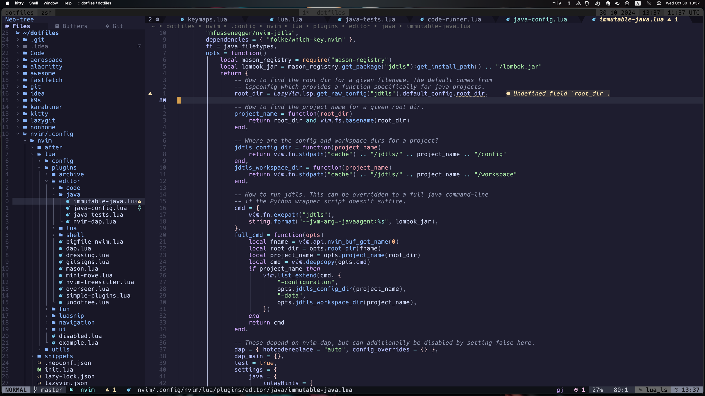

###### SCRATCHPAD

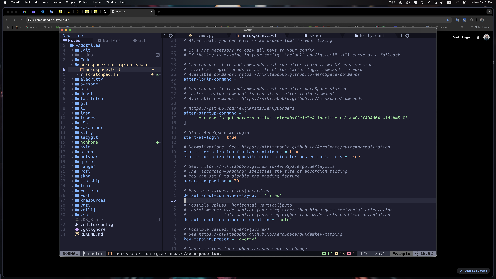

###### TMUX POPUP

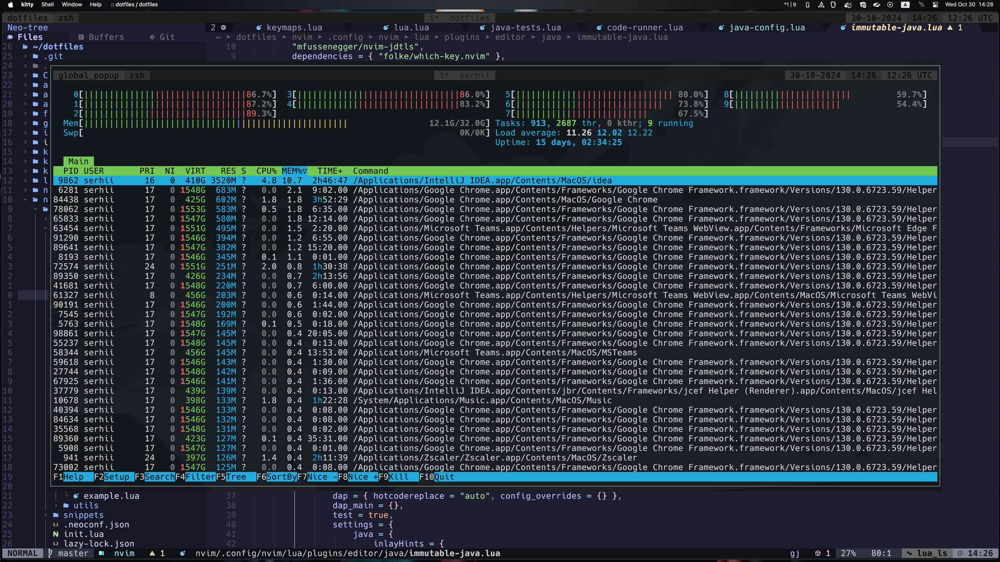

###### TMUX SESSION MANAGER

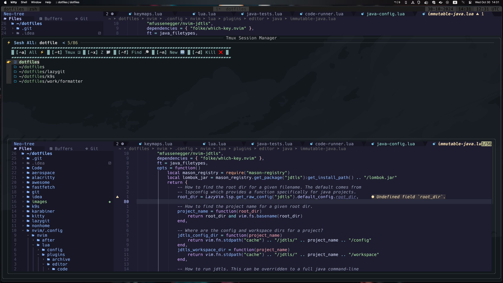

###### YAZI

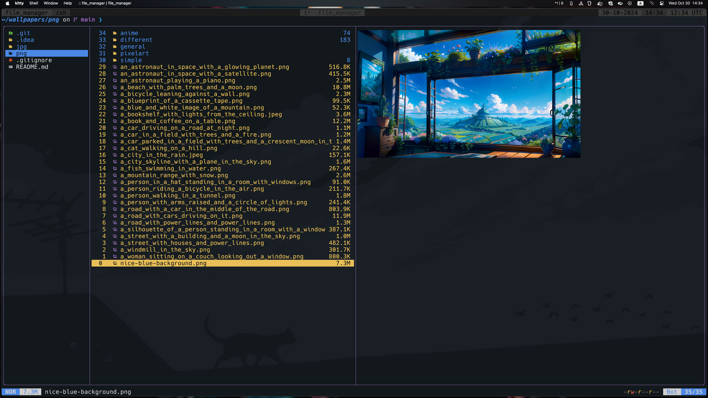

###### Intellij

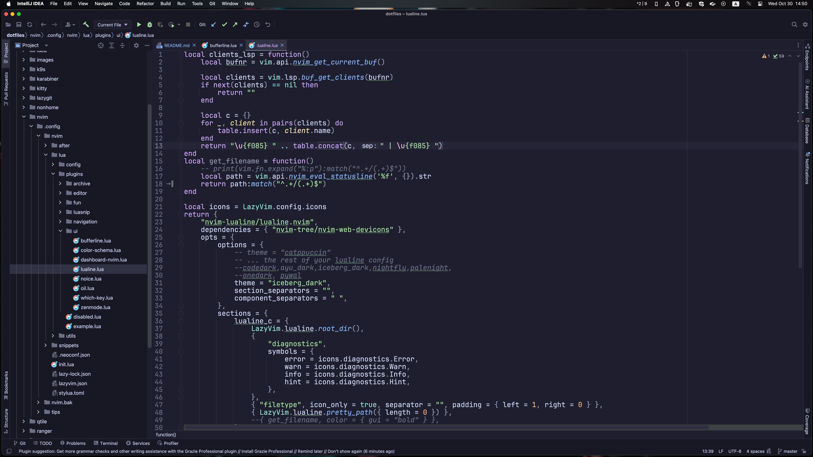

---

---

---

#### ARCH LINUX + I3WM + Polybar

###### DESKTOP

###### NEOVIM

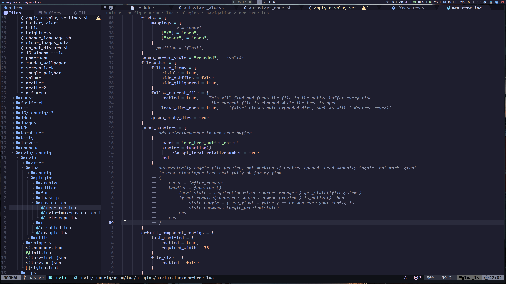

###### SCRATCHPAD

###### Intellij

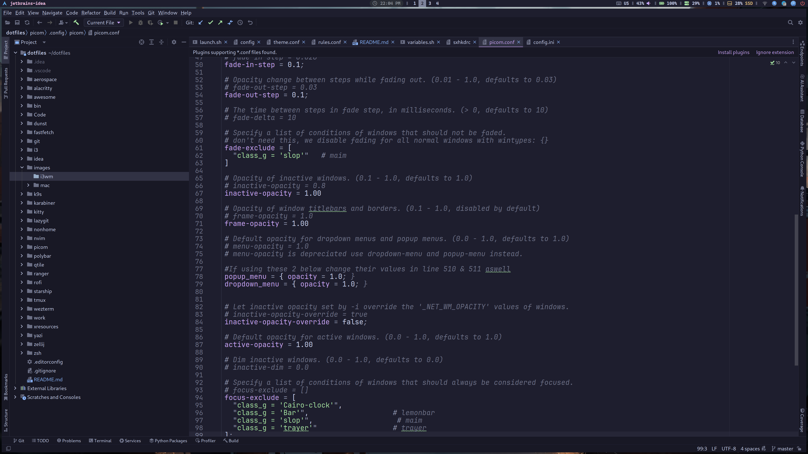

---

---

---

#### ARCH LINUX + QTILE

###### DESKTOP

###### NEOVIM
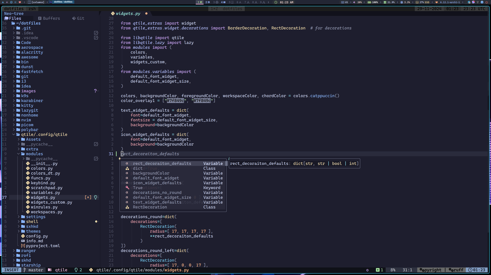

###### SCRATCHPAD
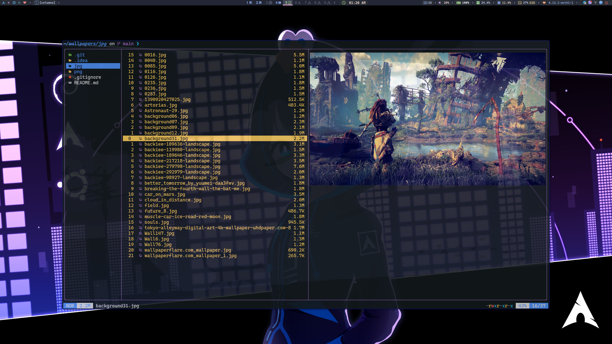

###### Intellij
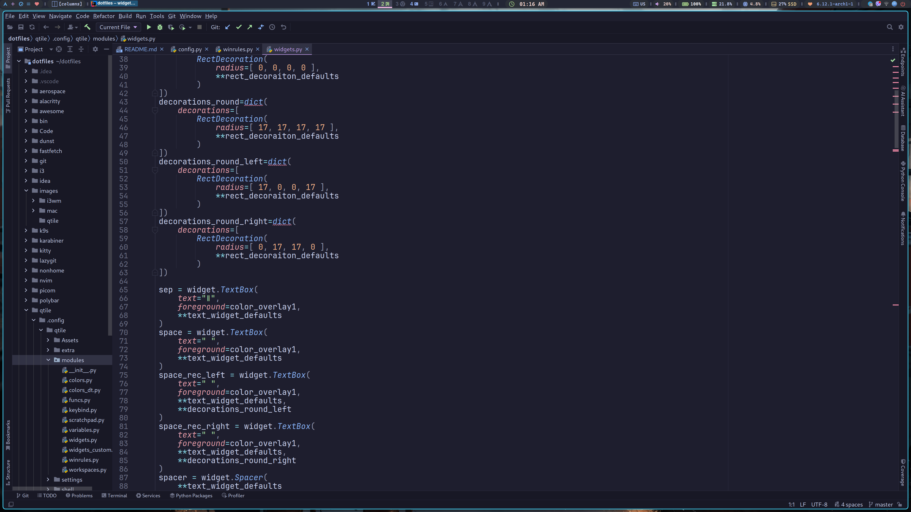

---

---

---

#### ARCH LINUX + AWESOME WM

...