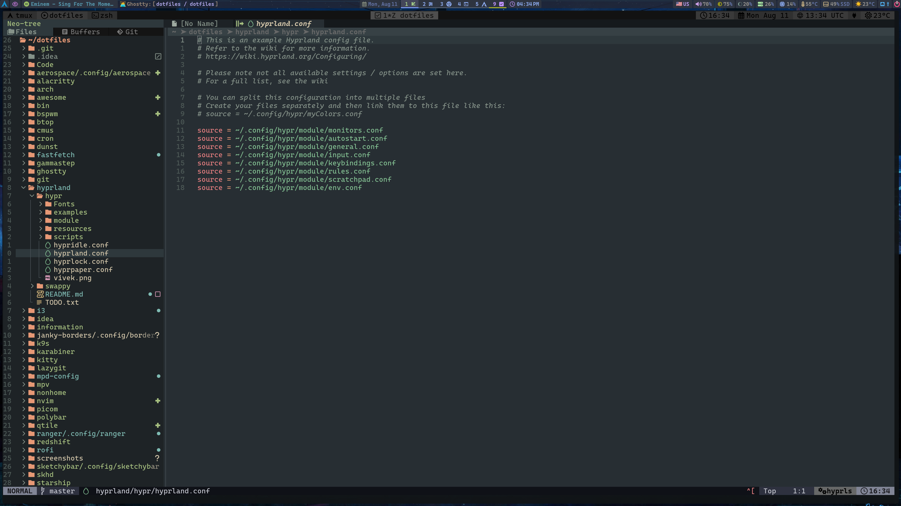
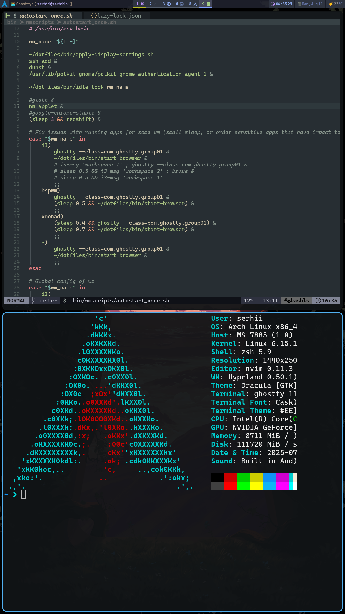

# Hyprland configs

Hyprland config and related tools manages directly by `ln` command
instead `stow` to not mess in root config dir

```bash
sudo ln -s ~/dotfiles/hyprland/hypr ~/.config/hypr
sudo ln -s ~/dotfiles/hyprland/swappy ~/.config/swappy

```

# Screenshots

##### MAIN MONITOR



##### SECOND MONITOR



##### SCRATCHPAD

