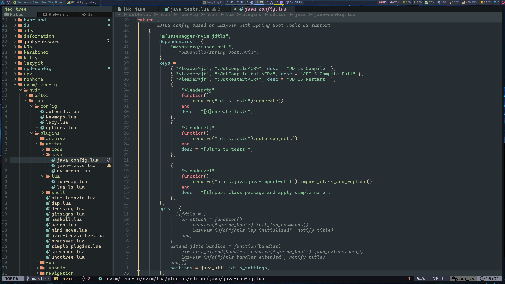
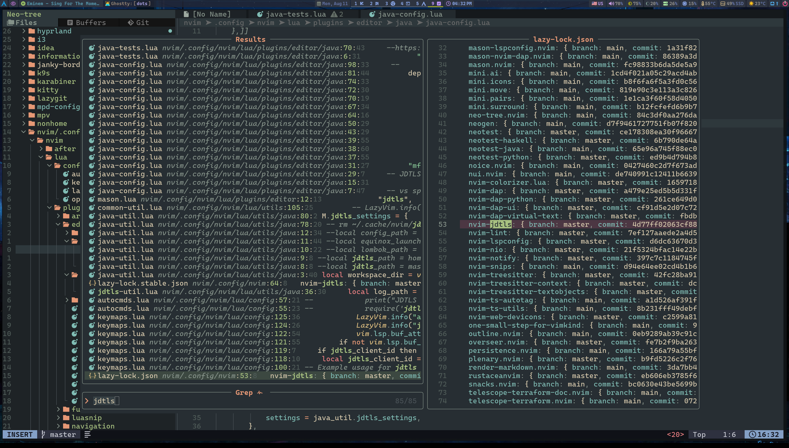

# My NEOVIM config.

### TODO LIST   :

      stabilize `java-refactor-util.lua` for fixing batch moved\renamed java files, pachages etc.
      create java cmd tool `java-class-explorer` to exploring java class byte code to request full qualified type names, fields, inner classes, enum values etc
      mapstruct completion support: using `java-class-explorer` write custom `blink-cmp-mapstruct-source`, where depends from `source` or `target` string context (using java treesitter) explore types from method parameters, or return type, fields list. `@Mapping and @ValueMapping (exploring enums)`
     integrate stevearc/overseer.nvim
     neotest-java - investigation of issue of not working debugging for some king of prjects using spring-boot
     better dap and dap ui configuration

### Screenshots

