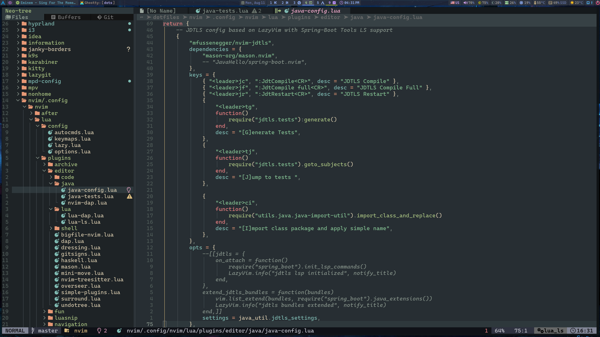
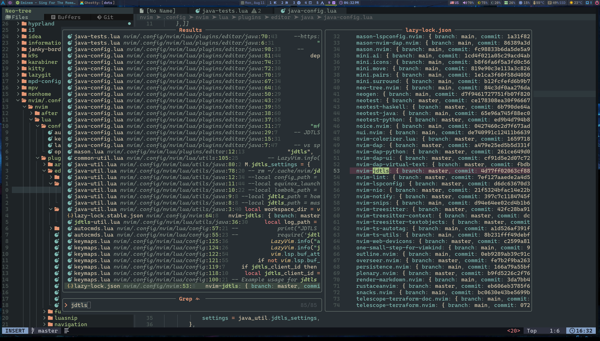

# My NEOVIM config.

### TODO LIST   :

     create java cmd tool `java-class-explorer` to exploring java class byte code to request full qualified type names, fields, inner classes, enum values etc
     mapstruct completion support: using `java-class-explorer` write custom `blink-cmp-mapstruct-source`, where depends from `source` or `target` string context (using java treesitter) explore types from method parameters, or return type, fields list. `@Mapping and @ValueMapping (exploring enums)`
     map struct support - implement goto definition separated path items in mapstruct mapping path
     map struct support - performance and speed improvements (especially javap run)
     neotest-java - investigation of issue of not working debugging for some king of prjects using spring-boot
     investigate stevearc/overseer.nvim integration and implement it to replace CRAG666/code_runner.nvim
     better dap and dap ui configuration (explore more convenient ways to debug java code)
     stevearc/overseer.nvim: implement junit test runners by using junit-platform-console-standalone with parsing result xml and diagnostics, qflist and marks support...
     implement java source depencenties (per project) fast search ability (with ability to search by `rg` and `fd` + snack pickers)
     big refactoring of `utils` and `modules`
     junit module: add ability to run tests for all proj modules, and to separated module (with selector, myabe with multiselect ability)
     jdtls: implement static members (not `private` static fields or methods) search by snack.picker and import by enter. (quite anoying old problem actually, that not resolved in jdt so far, especially in case transition from intellij as I'm)
     java: luasnip or related to unwrap ~builder: SomeClass name = builder -> to unwrap to: SomeClass.builder()[place cursor here].build();
     java: static import - add ability to import static members from inner classes
     java: highlight parameters of String.format, "".formatted, log.(info|warn|debug|error)("")
     new line indent, in case shiwf with more that 4, like:
     DAP: need ability to copy to clipboard evaluated variable value (and copy formatted valur by jq and xml [ :%!xmllint --format - ])
      ability to goto class by classpath (like in spring.factories, org.springframework.boot.autoconfigure.AutoConfiguration.imports) like:
        org.springframework.boot.EnvironmentPostProcessor=ua.raiffeisen.apigov.metrics.MetricsEnvironmentPostProcessor
        ua.raiffeisen.apigov.metrics.micrometer.ssl.config.SslMetricsAutoConfiguration
        ...
      stabilize `module.java.refactor` for fixing batch moved\renamed java files, packages etc. (especially renaming global packages src/test)
     replace java.nvim with own `module.java.refactor` and refactor integraions
     Ability to run/debug tests to rust
     Ability to run/debug tests to go
     Ability to run/debug tests to lua
     Ability to run/debug tests to bash
     Ability to run/debug tests to python
     Ability to run/debug tests to c# and diagnostics issues
     Ability to run/debug jest tests to js/ts, and debugging run
     Make java tests agnostics for maven/gradle
     last run (especially in debugging) with overseer not working in another lang implementations (except java)

```java
return paymentAccountPort.getSystemId(creditor.getIban())
    .filter(SystemId::isInternalSystem)
    .flatMap(ignore -> this.getCreditorInternalInfo(creditor.getIban()))
    .defaultIfEmpty(CREDITOR_DEFAULT);
```

### Screenshots



