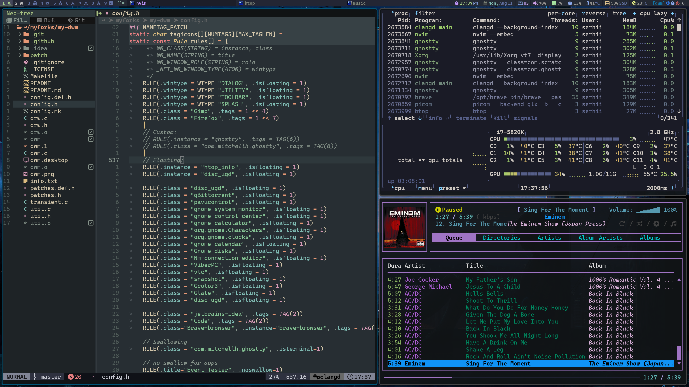
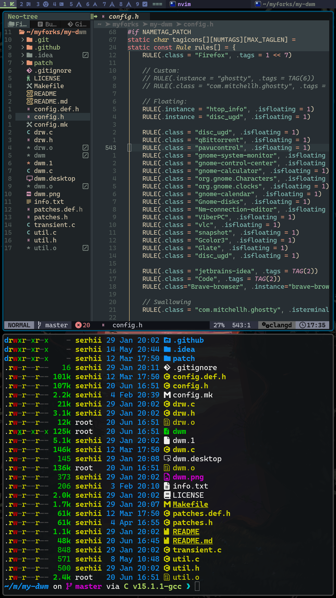
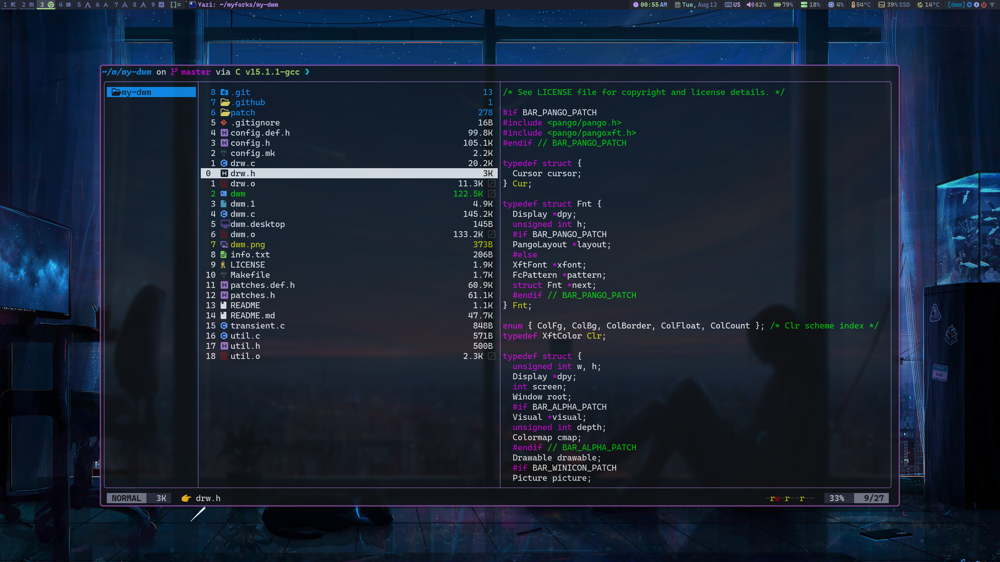

[My DWM config link](https://github.com/sergii-dudar/my-dwm)

# Screenshots

##### MAIN MONITOR

##### SECOND MONITOR

##### SCRATCHPAD

# List of applied dwm patches

## Standard dwm patches

- <https://dwm.suckless.org/patches/awesomebar/>
- <https://dwm.suckless.org/patches/statuscmd/>
- <https://dwm.suckless.org/patches/statuscmd/>
- <https://dwm.suckless.org/patches/status2d/>
- <https://dwm.suckless.org/patches/systray/>
- <https://dwm.suckless.org/patches/underlinetags/>
- <https://dwm.suckless.org/patches/winicon>
- <https://dwm.suckless.org/patches/statusallmons/>
- <https://dwm.suckless.org/patches/statuspadding/>
- <https://dwm.suckless.org/patches/alt-tab/>
- <https://dwm.suckless.org/patches/alwayscenter/>
- <https://dwm.suckless.org/patches/attachbottom/>
- <https://dwm.suckless.org/patches/autoresize/>
- <https://dwm.suckless.org/patches/cfacts/>
- <https://dwm.suckless.org/patches/cyclelayouts/>
- <https://dwm.suckless.org/patches/dragmfact/>
- <https://dwm.suckless.org/patches/movestack/>
- <https://dwm.suckless.org/patches/alpha/dwm-fixborders-6.2.diff>
- <https://dwm.suckless.org/patches/pertag/>
- <https://dwm.suckless.org/patches/save_floats/>
- <https://dwm.suckless.org/patches/sendmoncenter/>
- <https://dwm.suckless.org/patches/setborderpx/> ??
- <https://dwm.suckless.org/patches/swallow/>
- <https://dwm.suckless.org/patches/tagothermonitor/>
- <https://dwm.suckless.org/patches/viewontag/>
- <https://dwm.suckless.org/patches/warp/>
- <https://dwm.suckless.org/patches/bottomstack/>
- <https://dwm.suckless.org/patches/fibonacci/>

## dwm-flexipatch patches

- <https://github.com/bakkeby/patches/wiki/floatpos/>
- <https://github.com/bakkeby/patches/wiki/renamedscratchpads>
- <https://github.com/mitchweaver/suckless/blob/master/dwm/patches/mitch-06-rounded_corners-f04cac6d6e39cd9e3fc4fae526e3d1e8df5e34b2.patch>
- <https://github.com/bakkeby/patches/blob/master/dwm/dwm-sendmon_keepfocus-6.2.diff>
- <https://github.com/bakkeby/patches/blob/master/dwm/dwm-togglefullscreen-6.2.diff>
- <https://github.com/bakkeby/patches/wiki/toggletag>
- <https://github.com/bakkeby/patches/blob/master/dwm/dwm-vanitygaps-6.2.diff>
- <https://github.com/bakkeby/patches/blob/master/dwm/dwm-cfacts-vanitygaps-6.2.diff>

## dwm-flexipatch builtin

- BAR_LTSYMBOL_PATCH
- BAR_STATUS_PATCH
- BAR_TAGS_PATCH
- BAR_WINTITLE_PATCH
- CENTER_TRANSIENT_WINDOWS_PATCH
- DRAGCFACT_PATCH
- MONITOR_RULES_PATCH
- SEAMLESS_RESTART_PATCH
- VANITYGAPS_MONOCLE_PATCH
- TILE_LAYOUT
- MONOCLE_LAYOUT

## custom dwm extensions

- RENAMED_SCRATCHPADS_ONLY_ONE_PATCH