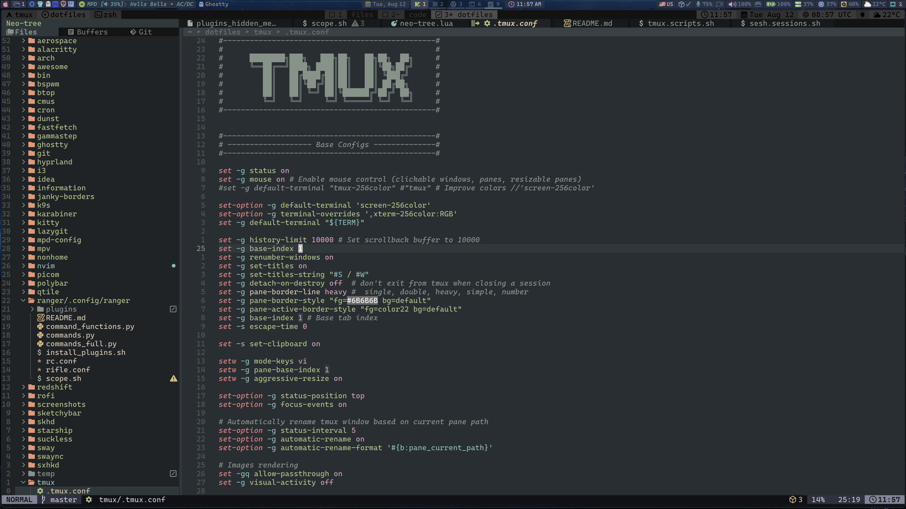
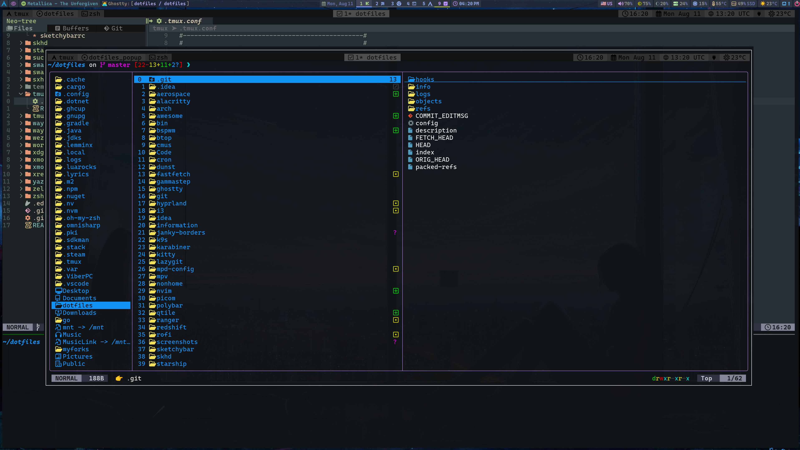
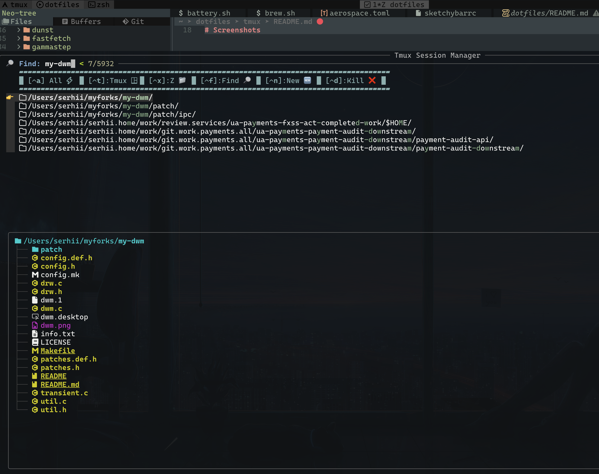
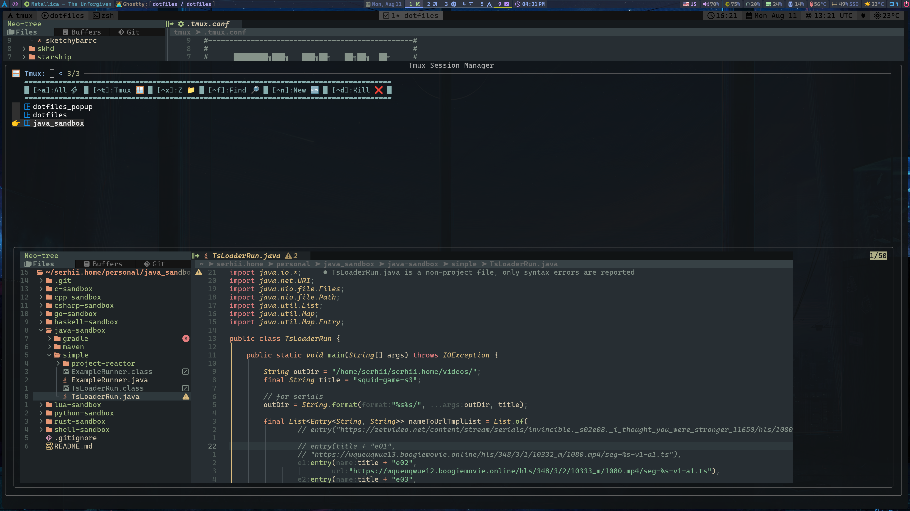

# Screenshots

##### Tmux session windows tabs

##### Tmux popup

##### Custom session manager with session preview (based on `joshmedeski/sesh` and `sainnhe/tmux-fzf`)

- sh configs: [sesh.sessions.sh](../zsh/serhii.shell/util/sesh.sessions.sh), [tmux.scripts.sh](../zsh/serhii.shell/tmux.scripts.sh)

