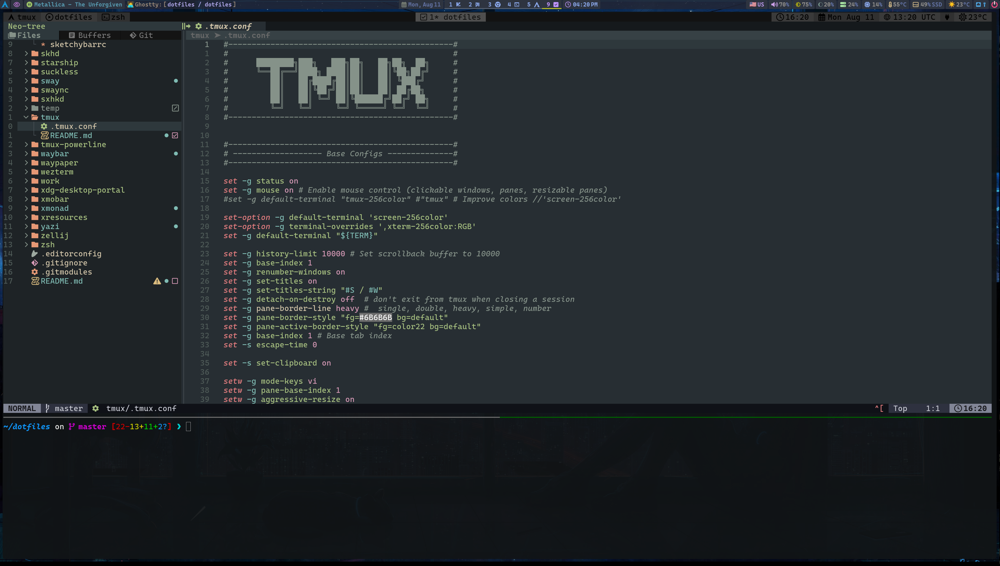
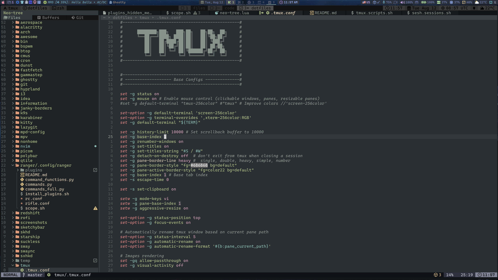
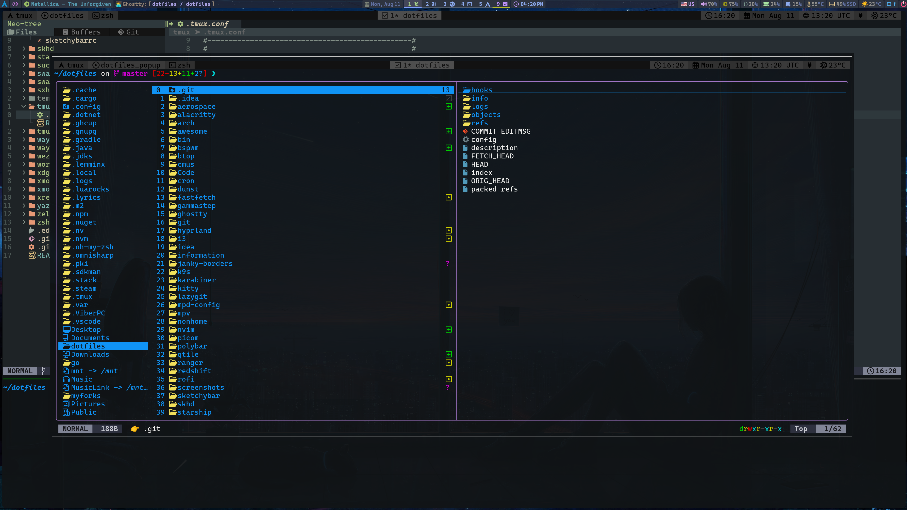
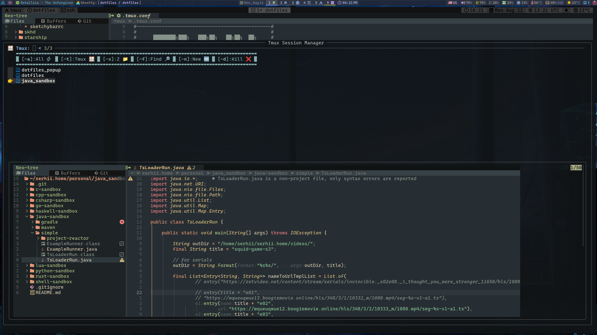
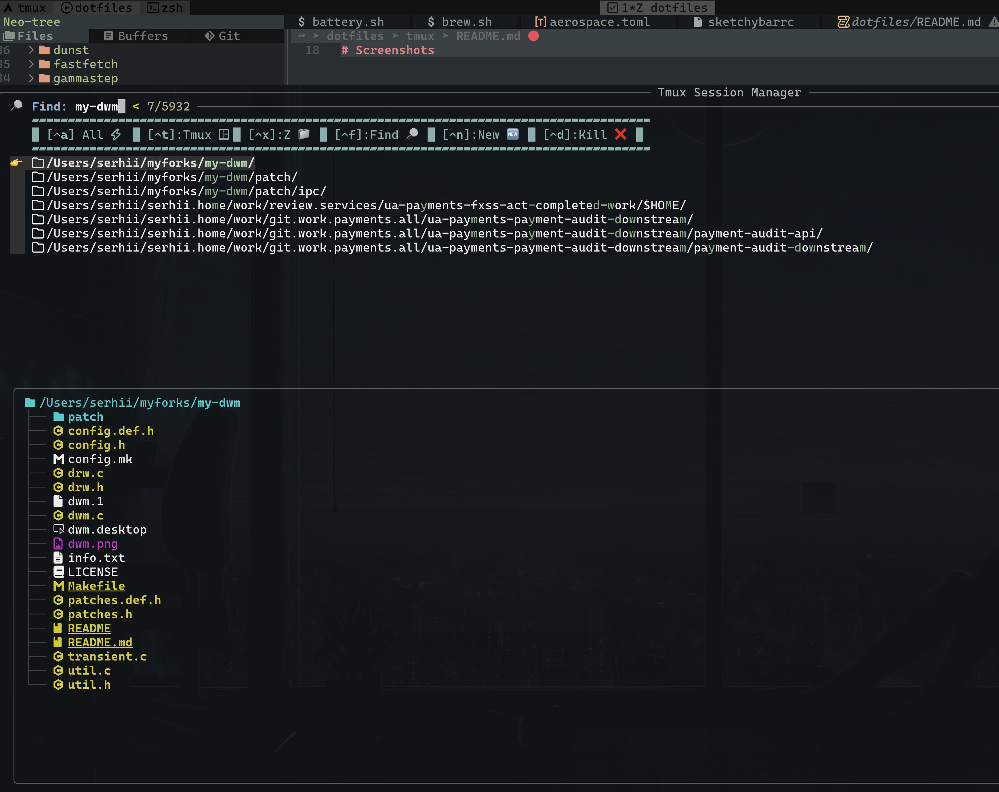

# Screenshots

##### Tmux session windows tabs

##### Tmux popup

##### Custom session manager with session preview (based on `joshmedeski/sesh` and `sainnhe/tmux-fzf`)

session manager have ability to:

- search (with pewview) exists sessions
- create new sessions from existing directory on system (with dir content preview), with ability to find by `fd`, `zoxide`
- put custom session name (no such dir), and create this session
- kill existing session
- show in mixed mode (existing session, and dirs up that had session recently)

###### Small demonstration

- with exists session preview

- with dir content preview to create new session

configs: [sesh.sessions.sh](../zsh/serhii.shell/util/sesh.sessions.sh), [tmux.scripts.sh](../zsh/serhii.shell/tmux.scripts.sh)

##### Translation

Self-contained, no tmux plugin: [translate.sh](../scripts/tmux/translate.sh) drives a vendored copy of
[translator.py](../scripts/tmux/translator/) (see its README for provenance and local patches).
Output always lands in a tmux popup.

| where you select | key | mode used |
| --- | --- | --- |
| tmux copy-mode | `t` | `pipe` |
| nothing — just type | `prefix + T` | `prompt` |
| system clipboard | `prefix + C-t` | `clipboard` |
| foot: mouse selection | `Control+Shift+t` | `pipe` (foot `pipe-selected`) |
| alacritty: mouse selection | `Control+Shift+t` | `clipboard` (needs `selection.save_to_clipboard`) |

Close the popup with `Enter` or `Esc` (`Ctrl-C` also works); in the typing prompt an empty line
closes it too.

Direction is auto-detected: Cyrillic input is translated to `@translate-from`, anything else to
`@translate-to`. Works outside tmux too: `./scripts/tmux/translate.sh --print "some text"`.

**Adding another terminal** is one config line in that terminal's own package — no script change.
Pick `pipe` if it can pipe the selection to a command (kitty `launch --stdin-source=@selection`,
wezterm `get_selection_text_for_pane`), otherwise `clipboard`. Terminal bindings run *outside* tmux,
so the script aims the popup at the most recently active client itself.

There is also an unbound `primary` mode (`translate.sh primary`) for the X11/Wayland PRIMARY
selection — mouse-selected text in a browser or any other app — if you ever want it on a WM hotkey.