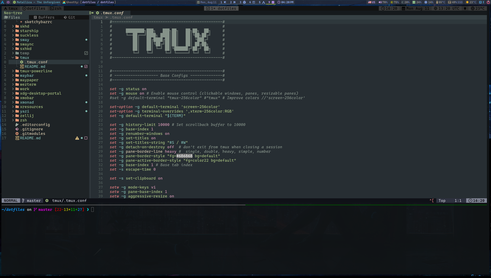
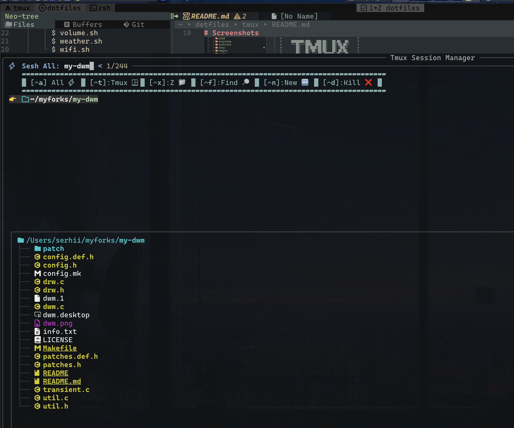

# Screenshots

##### Tmux session windows tabs

##### Tmux popup

##### Custom session manager with session preview (based on `joshmedeski/sesh` and `sainnhe/tmux-fzf`)

session manager have ability to:

- search (with pewview) exists sessions
- create new sessions from existing directory on system (with dir content preview), with ability to find by `fd`, `zoxide`
- put custom session name (no such dir), and create this session
- kill existing session
- show in mixed mode (existing session, and dirs up that had session recently)

###### Small demonstration

- with exists session preview

- with dir content preview to create new session

configs: [sesh.sessions.sh](../zsh/serhii.shell/util/sesh.sessions.sh), [tmux.scripts.sh](../zsh/serhii.shell/tmux.scripts.sh)
