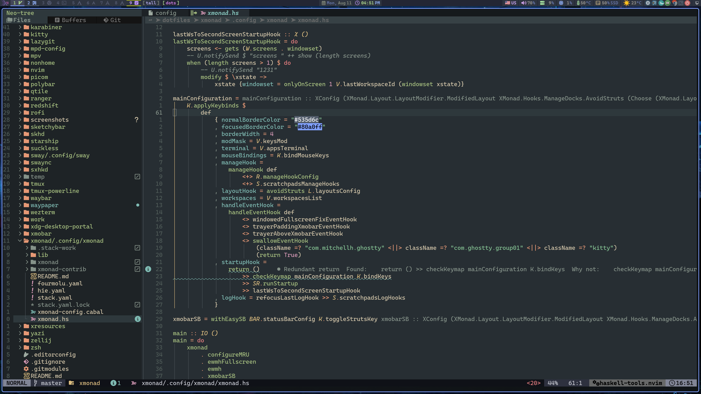
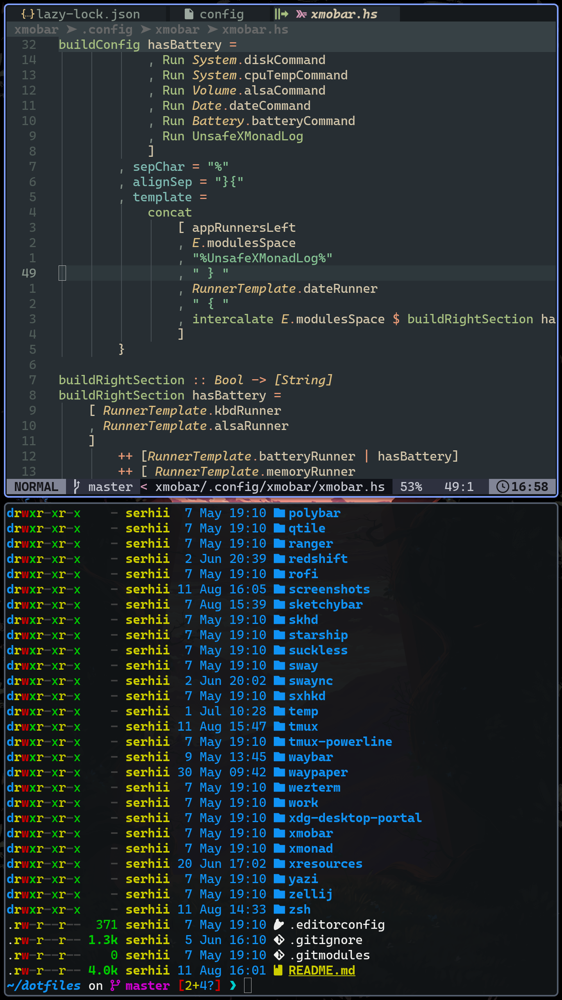
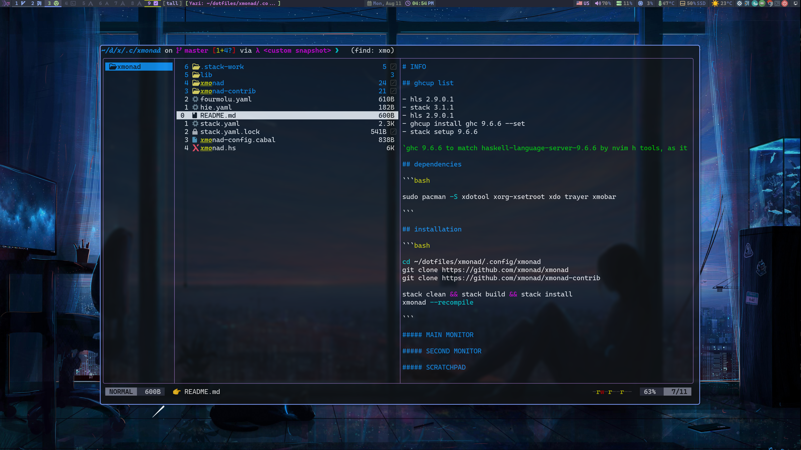

# INFO

## ghcup list

- hls 2.9.0.1
- stack 3.1.1
- hls 2.9.0.1
- ghcup install ghc 9.6.6 --set
- stack setup 9.6.6

`ghc 9.6.6 to match haskell-language-server-9.6.6 by nvim h tools, as it should match to lsp work properly`

## dependencies

```bash

sudo pacman -S xdotool xorg-xsetroot xdo trayer xmobar 

```

## installation

```bash

cd ~/dotfiles/xmonad/.config/xmonad
git clone https://github.com/xmonad/xmonad
git clone https://github.com/xmonad/xmonad-contrib

stack clean && stack build && stack install
xmonad --recompile

```

# Screenshots

##### MAIN MONITOR



##### SECOND MONITOR



##### SCRATCHPAD


